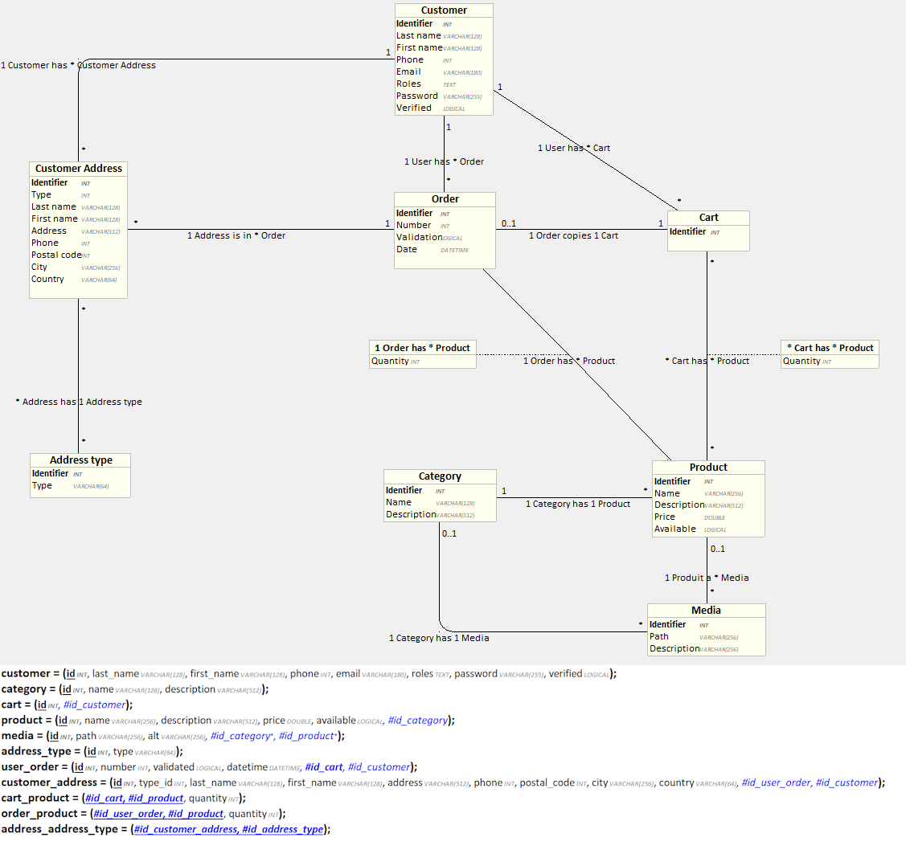

# Contributing to E-Commerce

All information related to contributing to the project can be found in this file. It is **mandatory** to read it before contributing to the project in order to follow the conventions and make the development process easier for everyone. Thank you for your understanding!

- [Contributing to E-Commerce](#contributing-to-e-commerce)
  - [Getting the Project](#getting-the-project)
  - [Installation \& Launch](#installation--launch)
    - [Via Docker](#via-docker)
      - [Prerequisites](#prerequisites)
        - [Install WSL to use Docker on Windows](#install-wsl-to-use-docker-on-windows)
        - [Install Docker on Linux/WSL](#install-docker-on-linuxwsl)
      - [Launch Docker Composition](#launch-docker-composition)
    - [Locally (not recommended)](#locally-not-recommended)
  - [Technical Design](#technical-design)
    - [Development Environment](#development-environment)
  - [Project Conventions](#project-conventions)
    - [Versioning](#versioning)
    - [Git](#git)
    - [Code](#code)
      - [Indentation](#indentation)
      - [Code Quality](#code-quality)
  - [Back-end Documentation](#back-end-documentation)
    - [Entity Relationship Diagram](#entity-relationship-diagram)
    - [Back-end Structure](#back-end-structure)
  - [Front-end documentation](#front-end-documentation)
    - [Mockups](#mockups)
    - [Front-end Structure](#front-end-structure)

## Getting the Project

The project is hosted in an online repository. It is recommended to associate your SSH keys with your account to clone the project via SSH for security reasons, but it is also possible to clone it via HTTPS.

Navigate to the folder where you want to clone the project (after creating it):  
On Windows:

```bat
cd %userprofile%\Documents\Projects\
```

On Linux:

```bash
cd ~/projects/
```

Clone via SSH:  

```bash
git clone git@github.com:MichaelAceAnderson/E-Commerce.git
```

Clone via HTTPS

```bash
git clone https://github.com/MichaelAceAnderson/E-Commerce.git
```

## Installation & Launch

### Via Docker

The application can run in a Docker container. To do this, you need to install Docker and Docker Compose, then launch the Docker composition.

Running the project directly locally is less recommended as it requires time-consuming installation and configuration of several applications (Nginx/PHP/MariaDB). Therefore, using Docker to launch the application is preferred.

#### Prerequisites

To launch the project via Docker, Docker and Docker Compose must be installed, which are not directly available on Windows (at least not via command line).

##### Install WSL to use Docker on Windows

You can use WSL (Windows Subsystem for Linux) to install Debian on which Docker and Docker Compose will be installed:

```bat
REM Set the WSL version to use (we use version 2 to be able to use Docker)
wsl --set-default-version 2
REM Install WSL
wsl --install -d Debian
REM Launch WSL
wsl
```

##### Install Docker on Linux/WSL

```bash
# Update the package list
sudo apt-get update
# Upgrade already installed packages
sudo apt-get upgrade
# Remove old versions of Docker
sudo apt remove docker docker-engine docker.io containerd runc

# Install necessary dependencies
sudo apt install --no-install-recommends apt-transport-https ca-certificates curl gnupg2
# Get the Docker installation script
curl -fsSL https://get.docker.com -o get-docker.sh
# Run the Docker installation script
sudo sh get-docker.sh

# Ensure Docker starts at machine startup
sudo systemctl enable docker
# Start the Docker service
sudo service docker start

# Verify Docker is installed correctly
sudo docker run --rm hello-world
```

To execute Docker-related commands, the user must have docker group rights (or execute as `root`).
If it doesn't already exist, create the docker group:

```bash
sudo groupadd docker
```

Then, add your user to the docker group:

```bash
sudo usermod -aG docker $USER
```

#### Launch Docker Composition

The project is organized in such a way as to directly identify files related to Docker and those related to the application.
The Dockerfiles are located in a `.docker` folder and then in a subfolder related to the concerned image (Example: [.docker/nginx/Dockerfile.dev](.docker/nginx/Dockerfile.dev)). There is a [.docker/docker-compose.dev.yml](.docker/docker-compose.dev.yml) file in the `.docker` folder that contains the interaction rules between the different services necessary for the application's operation.
There is also a [.dockerignore](.dockerignore) file that allows ignoring certain files when copying the application's source files into their respective Docker containers.

To launch the application, navigate to the Docker configuration folder and start the Docker Compose composition via the prepared script:

```bash
cd ./.docker
# NOTE ⚠️: The docker-start.sh script must be executed as root and requires docker group rights
# It is also possible to pass arguments to specify the environment (dev or prod) and choose whether to rebuild the containers, e.g., ./docker-start.sh --env=dev --rebuild
./docker-start.sh
```

The [docker-compose.dev.yml](./.docker/docker-compose.dev.yml) file will then execute the Dockerfile configuration of each application image (Example: [.docker/nginx/Dockerfile.dev](.docker/nginx/Dockerfile.dev)) to build the containers.

The environments are separated into three: local, dev, and prod. The local environment does not depend on Docker, but the [docker-start.sh](.docker/docker-start.sh) script allows specifying a dev or prod environment and automatically using the corresponding Docker Compose and Dockerfile files.

Once the container is launched, it is possible to explore it from the inside and execute commands via the shell:

```bash
sudo docker exec -it ecommerce-symfony-c sh
```

The application will then be available on localhost on the ports exposed in the Docker Compose configuration (Example: [docker-compose.dev.yml](.docker/docker-compose.dev.yml)).

**Note**: Database creation and migrations cannot be performed during container construction (since the database is not yet listening), and is executed by a startup script (e.g., [.docker/symfony/init/dev/entrypoint.sh](.docker/symfony/init/dev/entrypoint.sh)).

### Locally (not recommended)

The Docker composition already automates the setup of the development environment and deployment, but if you wish to do it manually, you need to:

1. Install PHP-FPM, Nginx, and MariaDB
2. Configure Nginx to use PHP FPM to serve the index file from the [public](symfony/public) folder
   - Configure the web server to accept requests of sufficient size for multiple uploaded files (e.g., `client_max_body_size 1024M`)
   - Install PHP 8.2.3 (or a version compatible with the used version of Symfony and the application code)
   - Configure the web server to communicate with PHP (possibly PHP-FPM)
   - Configure PHP to enable the extensions necessary for running Composer or the Symfony application (`curl`, `pdo`, `zip`, `fileinfo`, ...)
   - Configure PHP to accept a sufficient file size for uploads (e.g., `upload_max_filesize = 8M`, `post_max_size = 8M`)
   - Install MariaDB 11.2.2
     - Configure the database from the environment variables in [.env.local](symfony/.env.local)
   - Install Composer
     - Install the project's [symfony](symfony/) folder dependencies with Composer (`composer install`)
3. Ensure that the database credentials specified in the [.env.local](symfony/.env.local) file exist in the database management system
4. When the user specified in the [.env.local](symfony/.env.local) file has correct access to the database, create the database with `php bin/console doctrine:database:create`.
   - In case of an existing database, use the following commands to create the tables and add an initial dataset:
     - [Optional] If data already exists, delete it with the command `php bin/console doctrine:schema:drop --full-database --force`
   - Create the tables from the entities with the command `php bin/console doctrine:schema:update --force --complete`
     - Add an initial dataset with the command `php bin/console doctrine:fixtures:load`
   - In case of an empty database, create the tables with `php bin/console doctrine:migrations:migrate`
5. Create the tables with `php bin/console doctrine:migrations:migrate`
6. Start the database and the server, either by starting PHP-FPM and Nginx or with the Symfony CLI `symfony server:start --port=8000` (or any other port as long as it is also configured on the front-end side)
7. The application is accessible at `http://localhost:8000`

## Technical Design

### Development Environment

For reference, here are the latest tested versions of the applications used for the project:

| Component     | Version     |
|---------------|-------------|
| Web server    | Nginx 1.25.3|
| PHP version   | 8.2-FPM     |
| Symfony version | 7.1.1     |
| DBMS          | MariaDB 11.2.2|

## Project Conventions

### Versioning

This project adheres to [Semantic Versioning](https://semver.org/). The version number is composed of three parts: major, minor, and patch. The version number is incremented according to the following rules:

- Major: making all related apps in previous versions incompatible with the current version
- Minor: added functionality in a backwards-compatible manner
- Patch: backwards-compatible bug fixes

Generally, versions must be incremented according to the following rules:

- breaking change: +1.0.0
- new feature: +0.1.0
- bug fix: +0.0.1
- other (refactor, indentation, ...): +0.0.01

### Git

⚠️ **Warning**: Always test your code and try to remove errors/warnings before commiting and/or submitting a pull request.  

- Commits should clearly describe their content and remain short. The commit message should be in English and include both the type of commit and the scope of the changes. If the change is global or not related to a specific feature/place in the code, the scope is optionnal.  
  ⚠️If the changes are related to an issue, the scope **must** be the issue number.
  - [Conventional Commits](https://www.conventionalcommits.org/en/v1.0.0/)
    - `feat(scope)`: new feature (e.g., *feat(#1): authentication*)
    - `fix(scope)`: bug fix (e.g., *fix(#2): fixed communication problem regarding login*)
    - `docs(scope)`: documentation (e.g., *docs(#3): updated README*)
    - `style(scope)`: changes that do not affect the code (spacing, formatting, etc.) (e.g., *style: fixed indentation*)
    - `refactor(scope)`: code changes that neither fix a bug nor add a feature (e.g., *refactor(#5): optimized code*)
    - `perf(scope)`: performance improvement (e.g., *perf(#6): improved speed*)
    - `test(scope)`: adding or modifying tests (e.g., *test(#7): added unit tests*)
    - `conf(scope)`: build configuration changes (e.g., *conf(#8): updated Dockerfile*)
    - `chore(scope)`: changes to the development environment or project organization (e.g., *chore(#9): updated .gitignore*)
- Every branch must be associated with one type of change (see below) and be created from the `develop` branch. Everytime you finish changes on a branch, you must have it reviewed and merged back into `develop` so that the branch can be deleted and the changes can be integrated into the project. When enough features are ready, it is then possible to merge `develop` into `release/x.x.x` depending on the version number, then make small changes on the release branch in case of bugs, and finally merge the release branch into `main` to deploy the changes.
  - [Gitflow](https://www.atlassian.com/git/tutorials/comparing-workflows/gitflow-workflow)
    - `feat/xxxx-name-of-the-feature`: New feature referenced by the issue number and a short description (e.g., `feat/1-authentication`)
    - `fix/xxxx-name-of-the-fix`: Bug fix referenced by the issue number and a short description (e.g., `fix/2-login-error`)
    - `docs/xxxx-name-of-the-docs`: Documentation referenced by the issue number and a short description (e.g., `docs/3-readme`)
    - `style/xxxx-name-of-the-style`: Style changes referenced by the issue number and a short description (e.g., `style/4-indentation`)
    - `refactor/xxxx-name-of-the-refactor`: Refactoring referenced by the issue number and a short description (e.g., `refactor/5-optimization`)
    - `perf/xxxx-name-of-the-perf`: Performance improvement referenced by the issue number and a short description (e.g., `perf/6-speed`)
    - `test/xxxx-name-of-the-test`: Test changes referenced by the issue number and a short description (e.g., `test/7-unit`)

### Code

#### Indentation

Indentation must be done with tabs and not spaces.  
Use the [Prettier](https://prettier.io/) code formatter to ensure consistent code style. [Prettier for VSCode](https://marketplace.visualstudio.com/items?itemName=esbenp.prettier-vscode)

#### Code Quality

- Use LF line endings
- Your code must be as modulable and easily reusable as possible.
- Files should be grouped into a folder hierarchy according to their role
- Your code must be as self-explanatory as possible. If you cannot find a way to make it so, comment "why" and not "how" you did it
- Explicitly name variables and functions (which should remain short) to avoid the need for comments
- File, folder, variable names, and code in general must be in English
- Comments must be in English
- Variables and functions must follow the conventions of their respective language
  - HTML:
    - [Code Guide](https://codeguide.co/#html-syntax)
    - Headings h1, h2, h3, etc. should be used in order within the same section to maintain a logical hierarchy even without CSS.
  - CSS & SCSS:
    - kebab-case
    - Component isolation (similar to BEM to avoid conflicts in case of global styles)
    - Stylesheets should handle presentation, not logic (which should be delegated to HTML).
  - JavaScript:
    - camelCase
    - [Airbnb JavaScript Style Guide](https://github.com/airbnb/javascript)
  - Twig:
    - [Twig Coding Standards](https://twig.symfony.com/doc/3.x/coding_standards.html)
  - PHP:
    - camelCase
    - [PSR-12](https://www.php-fig.org/psr/psr-12/)

## Back-end Documentation

### Entity Relationship Diagram

The business entities of the application are listed in the Looping [LDM](_docs/uml/UML.loo) and the [Entity](src/Entity) folder of the back-end.  
.

### Back-end Structure

The back-end is divided into 6 parts:

- Controllers (in the [Controller](symfony/src/Controller) folder) that handle HTTP requests, responses, redirections, and entity processing by calling repositories, with common methods defined through inheritance from [AbstractEntityController](symfony/src/Controller/AbstractEntityController.php).
- Fixtures (in the [DataFixtures](symfony/src/DataFixtures) folder) that populate the database with initial data for testing.
- Entities (in the [Entity](symfony/src/Entity) folder) created from the LDM and inheriting from [AbstractEntity](symfony/src/Entity/AbstractEntity.php).
- Repositories (in the [Repository](symfony/src/Repository) folder) that manage SQL queries via the Doctrine ORM and data returns for each entity, with a common CRUD through inheritance from [AbstractEntityRepository](symfony/src/Repository/AbstractEntityRepository.php).
- Forms (in the [Form](symfony/src/Form) folder) that handle data validation and entity creation.
- The [Security](symfony/src/Security) folder that manages application security, particularly regarding user authentication and authorization.

## Front-end documentation

### Mockups

[Figma mockups](https://www.figma.com/file/FcrvcG2XaBvd17rziCziX1/E-commerce?type=design&node-id=0-1&mode=design&t=7vRWdYBR9KUjd9Se-0)

### Front-end Structure

The generic routes of the application accessible to users are defined in the [AppController](symfony/src/Controller/AppController.php) file and are called from the front-end via links or forms.
These routes are responsible for displaying pages to users via the template system (Twig) and processing the received data.

The views are located in the [templates](symfony/templates/) folder, which is divided into four parts:

- The [icons](symfony/templates/icons) contain the SVG icons used in the application since they need to be included rather than used as img to be styled with CSS.
- The [structure](symfony/templates/structure) contains the common [base](symfony/templates/structure/base.html.twig) for all pages, as well as the [header](symfony/templates/structure/header.html.twig) and [footer](symfony/templates/structure/footer.html.twig) included in it.
- The [pages](symfony/templates/pages) contain the views of the different pages of the application, including the structure.
- The [tests](symfony/templates/tests), accessible on the `/test/` route, contain various front-end or (upcoming) back-end tests.

The application's style is managed by the [public/assets](symfony/public/assets) folder, which contains the necessary CSS and JS files for the application's presentation and interaction.
Notably, it includes:

- The [CSS](symfony/public/assets/style/css/) contains the [themes](symfony/public/assets/style/css/theme/) and [components](symfony/public/assets/style/css/components/) divided using the SASS pre-processor, which allows decomposing a stylesheet with .scss imports (having more permissive syntax and features) and then recompiling everything into a .css file used in production.
- The [assets](symfony/public/assets/), particularly the [images](symfony/public/assets/img/), including brand logos and stylistic images (e.g., [banner](symfony/public/assets/img/banner)).

The media uploaded by users are stored in the [public/uploads/media](symfony/public/uploads/media/) folder.
