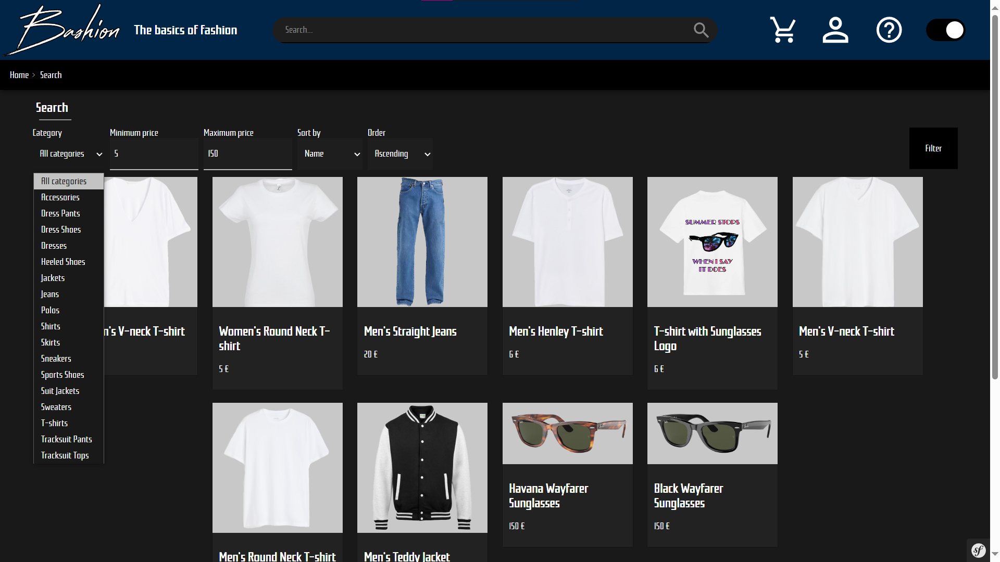
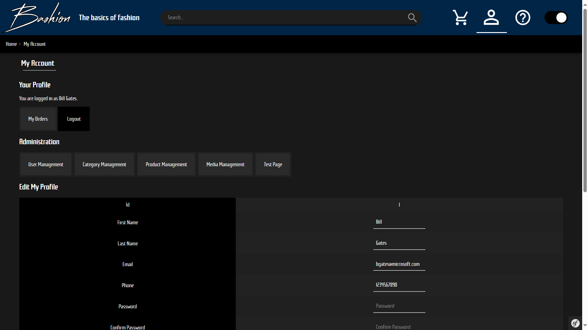
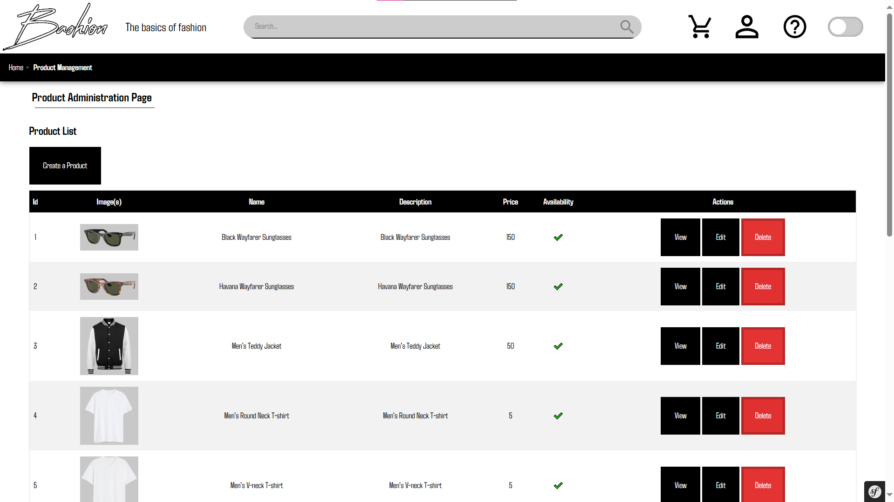

# E-Commerce

## Summary

- [E-Commerce](#e-commerce)
  - [Summary](#summary)
  - [Introduction](#introduction)
  - [Changelog](#changelog)
  - [Contributing to the project](#contributing-to-the-project)

## Introduction

This is a monolith application for a basic E-commerce project where users can browse products, manage their cart, their profile and make orders.  
  
  
  
  

## Changelog

All notable changes to this project will be documented in the [CHANGELOG.md](CHANGELOG.md).

## Contributing to the project

Before starting, please read the [License](LICENSE) to understand the permissions and limitations of the project.
All information related to contributing to the project can be found in the [CONTRIBUTING.md](CONTRIBUTING.md) file. It is **mandatory** to read it before contributing to the project in order to follow the conventions and make the development process easier for everyone. Thank you for your understanding!
